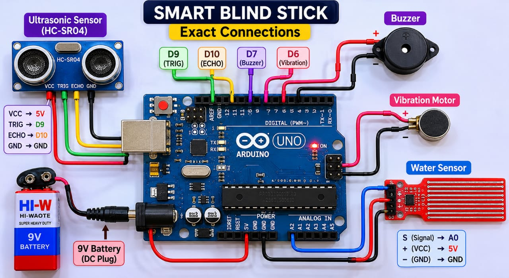
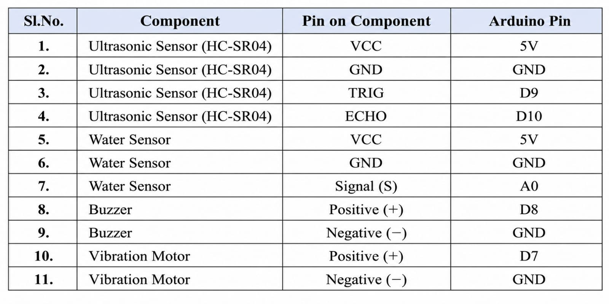
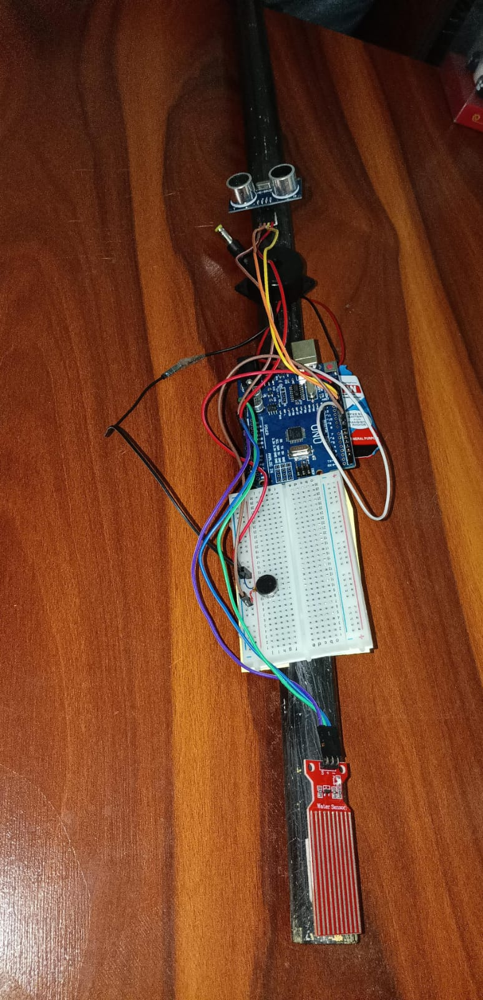

# IoT-Based Smart Blind Stick

An IoT-based Smart Blind Stick designed to assist visually impaired people through real-time obstacle and water detection, with different buzzer sounds and vibration alerts for different situations, improving safety and mobility.

## Components Used

- Arduino UNO
- Ultrasonic Sensor
- Water Sensor
- Buzzer
- Vibration Motor
- Breadboard
- Jumper Wires
- Battery

## Features

- Real-time obstacle detection
- Water detection
- Different buzzer sounds for different situations
- Vibration alerts for obstacle detection
- Helps improve safety and mobility

## How It Works

The ultrasonic sensor detects obstacles in front of the user, while the water sensor detects water hazards.

Based on the detected situation, the Arduino provides different buzzer sounds and vibration alerts to notify the user.

## Connection Diagram

## Pin Configuration

## Project Prototype

## Demo Video

[Watch the Smart Blind Stick Demo](https://drive.google.com/file/d/1pSB420FKAlmieqqvQeBTWvb0KXS73aer/view?usp=drivesdk)

## Future Scope

The project can be further enhanced by adding GPS, voice assistance, GSM connectivity, and IoT-based monitoring.
